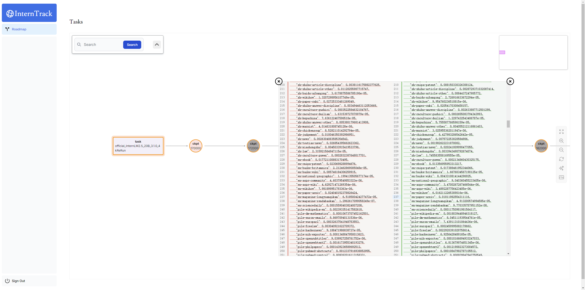

# InternTrack

## Docker启动

#### 1. 拉取镜像

`docker pull mcplayerfromprc/interntrack:v0.1`

#### 2. 创建镜像

`docker run -itd --restart=always -e ARANGO_ROOT_PASSWORD=[your-password] -p 8529:8529 -p 3000:3000 mcplayerfromprc/interntrack:v0.1`

#### 3. 进入容器

`docker exec -it [container_id] bash`

#### 4. 启动服务端

`nohup pnpm dev &`

#### 5. 公司网段linux转发

VSCODE端口转发后再socat转发
`sudo socat TCP-LISTEN:3000,reuseaddr,fork TCP:127.0.0.1:3001`

## Documents

[InternTrack文档](https://aicarrier.feishu.cn/wiki/DNRuw3XVSizmVekml0gcnncnnzg?from=from_copylink)

## Scaffold - Next.js App Router Course - Final

This is the final template for the Next.js App Router Course. It contains the final code for the dashboard application.

For more information, see the [course curriculum](https://nextjs.org/learn) on the Next.js Website.
